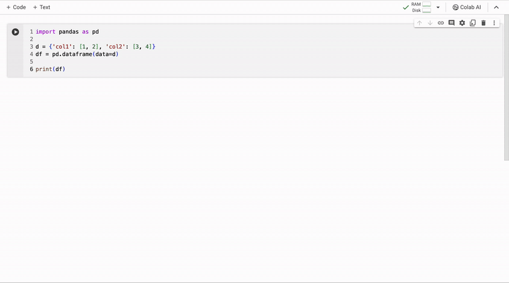

# Plotly交互式可视化

需要说明的是，这套课程会使用“想到哪里，写到哪里”的方式。因为这本身是我（李鲁鲁）给自己的探索课程。

这里我们注意到datawhale已经有一个 [wow-plotly](https://github.com/datawhalechina/wow-plotly) 的项目。这个项目介绍了plotly的基础代码。但是这个repo不能满足我的几个问题

- 为什么我们要用plotly， plt不行吗？
- plotly里面一些很重要的hover之类的特性，比如我在知乎笔记中用到的这些能够体现plotly特性的并没有体现 （ https://zhuanlan.zhihu.com/p/646948797 ）
- 作为一个数据工作者，我并不想太去记忆plotly的底层代码。而想用prompt的方式来关联我的数据。

# 为什么要用plotly

我最早是在探究colab的时候发现的plotly这个库。和Matplotlib一样，plotly的图片可以直接在colab中进行显示。但是plotly有更多鼠标交互，移动到数据点上能够显示额外信息之类的功能。这些是plt所没有的。你可以用下面这个prompt，来获取更多plotly和plt之间的差别

```
我正在准备一门数据可视化的课程，第一节课会涉及plotly

我知道plotly相比matplotlib有下面特点

- 都可以在notebook 中显示
- 有交互鼠标hover显示等功能

思考一下告诉我plotly相比plt还有什么好处
```

可以发现，plotly和页面是有更好的兼容性的，这也是为什么我们在后面使用交互式数据可视化的时候，更多选用plotly的原因。

# 使用AI生成代码

整套课都会使用类似下面这样的prompt来进行开发

```
给我一段plotly画图的例子代码

要左右两个子图 左边是折线图，右边是直方图
```

来避免最直接输入代码。当然你会发现ai的代码很多时候不是全对的，所以我们人类要慢慢建立读取和调整生成后代码的能力。

# 使用colab进行开发

由于colab无缝集成了一个（弱化的）gemini ai编程。这使得我们的课程的虚拟运行环境+ AI容易被控制。所以第一节课我会使用colab来进行讲解。

如果你不想用colab，直接使用notebook打开对应的ipynb文件就可以。但是使用colab的话你可以把prompt逐个输入，跟进整个课程的用prompt生成代码的过程。

再你打开colab后，可以使用下面这个gif图中类似的方法打开 gemini输入prompt进行编程




# 移步colab

我们后面的课程将在colab中进行

[](https://colab.research.google.com/drive/1JFe7If4J7wVpjhtcvYUbScRltsG8AGhM?usp=sharing)

如果你不喜欢colab，可以直接使用 [chapter1/01_plotly_visualization_with_ai.ipynb](01_plotly_visualization_with_ai.ipynb)